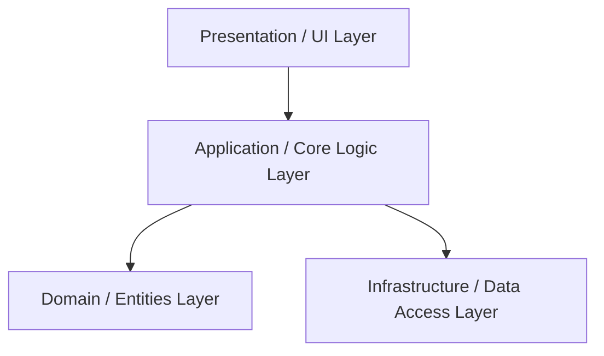

 Architecture Design Document

This document describes the high-level architecture, design patterns, and system structure of the project. It serves as a guide for developers to understand how different components interact and the principles guiding our design decisions.

## Overview

The system is designed with a focus on modularity, scalability, testability, and maintainability. It follows a layered architectural pattern to decouple concerns and enforce boundaries between different domains of the application.

## Key Principles

- **Separation of Concerns (SoC):** Distinct features and responsibilities are separated into individual components/modules.
- **Dependency Inversion:** High-level policy modules do not depend on low-level detail modules; both depend on abstractions.
- **Single Source of Truth:** Data models and configurations should have a single, definitive representation.
- **Fail Fast:** Validate inputs and configurations as early as possible to prevent cascading failures.

## Architectural Layers

The codebase is organized into several distinct layers:

### 1. Presentation Layer (UI / API Gateway)
- Handles user interactions, web requests, and CLI command execution.
- Responsible for request validation, serialization, deserialization, and rendering views or JSON/GraphQL responses.
- Keeps no business logic; it merely delegates to the Application Layer.

### 2. Application / Core Logic Layer
- Contains the orchestration logic, use cases, and business workflow engines.
- Connects the presentation interfaces to the appropriate domain models and external service adapters.

### 3. Domain Layer
- Houses the core business models, entities, value objects, and domain rules.
- This layer has zero external dependencies (pure logic) to ensure business rules can be verified easily without database or network setup.

### 4. Infrastructure Layer
- Manages persistent storage, external API integrations, caching, messaging queues, and file storage.
- Implements the abstract interfaces defined in the domain and application layers.

## Data Flow

A typical request-response life cycle follows these steps:

1. **Request Ingress:** An external system or user triggers an event (e.g., HTTP request or scheduled cron job).
2. **Routing & Middleware:** The request is routed to the correct handler, passing through authentication, authorization, and rate-limiting middleware.
3. **Validation:** Input payload is validated against a schema.
4. **Use Case Execution:** The routing handler invokes an application use case service.
5. **Persistence/External Interaction:** The use case fetches or persists entities using repository interfaces, which interact with the infrastructure layer.
6. **Result Formatting:** The use case returns a result, which is formatted and returned to the client as a standardized response.

## Technology Stack

- **Core Runtime/Language:** [To be specified per project (e.g., TypeScript, Python, Go)]
- **Framework/Library:** [e.g., Express.js, FastAPI, Gin]
- **Database:** [e.g., PostgreSQL, MongoDB, Redis]
- **Testing:** [e.g., Jest, PyTest, Go Test]
- **CI/CD:** GitHub Actions

## Future Enhancements & Scalability

- **Event-Driven Integration:** Introduction of message brokers (e.g., RabbitMQ, Kafka) for asynchronous task processing.
- **Microservices Migration:** The separation of services makes it straightforward to split off domain sub-modules into microservices as scaling demands increase.